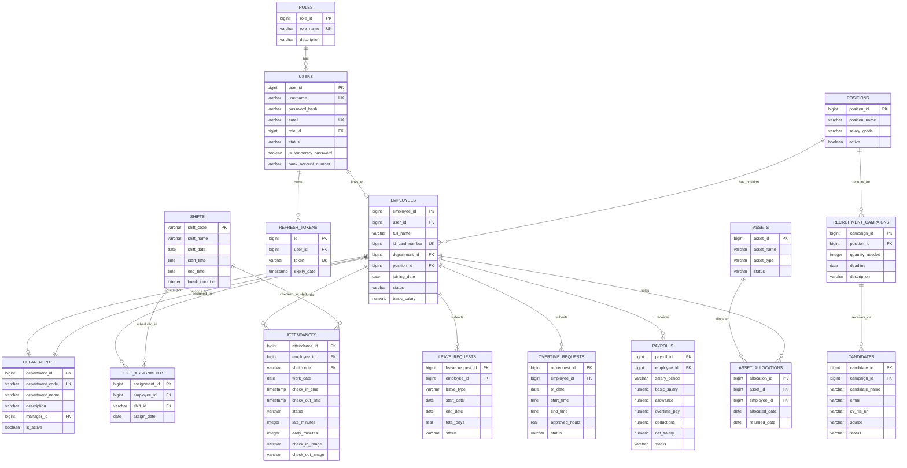

# 🗄 Database Design & Schema Documentation - HRMS Backend

Tài liệu Thiết kế và Cấu trúc Cơ sở Dữ liệu cho hệ thống **HRMS Backend**. Hệ thống sử dụng hệ quản trị cơ sở dữ liệu quan hệ **PostgreSQL**, quản lý ánh xạ thực thể thông qua **Spring Data JPA / Hibernate**, kết hợp cơ chế kiểm toán tự động (**JPA Auditing**).

---

## 1. Tổng Quan Kiến Trúc Cơ Sở Dữ Liệu

- **Hệ quản trị CSDL:** PostgreSQL 16+
- **Dialect Hibernate:** `org.hibernate.dialect.PostgreSQLDialect`
- **Chiến lược sinh bảng:** `spring.jpa.hibernate.ddl-auto=update`
- **Quy chuẩn đặt tên:** 
  - Tên bảng: Số nhiều, chữ thường, dấu gạch dưới (`snake_case`) - Ví dụ: `employees`, `leave_requests`.
  - Tên cột: Chữ thường, dấu gạch dưới (`snake_case`) - Ví dụ: `employee_id`, `created_at`.
- **Thực thể cơ sở kế thừa (`BaseEntity`):** Tất cả các bảng nghiệp vụ chính đều kế thừa từ `BaseEntity` để tự động lưu vết dữ liệu kiểm toán gồm:
  - `created_at` (`TIMESTAMP`): Thời điểm tạo bản ghi.
  - `created_by` (`VARCHAR(50)`): Người tạo bản ghi.
  - `updated_at` (`TIMESTAMP`): Thời điểm cập nhật cuối cùng.
  - `updated_by` (`VARCHAR(50)`): Người cập nhật cuối cùng.

---

## 2. Sơ Đồ Thực Thể Quan Hệ (Entity-Relationship Diagram - ERD)

---

## 3. Từ Điển Dữ Liệu Chi Tiết (Data Dictionary)

### 3.1 Bảng `roles` (Vai trò & Phân quyền)
Lưu trữ danh mục vai trò người dùng trong hệ thống.

| Tên Cột | Kiểu Dữ Liệu | Ràng Buộc | Mô Tả |
| :--- | :--- | :--- | :--- |
| `role_id` | `BIGINT` | `PK, AUTO_INCREMENT` | Định danh vai trò |
| `role_name` | `VARCHAR(50)` | `NOT NULL, UNIQUE` | Tên vai trò (`ADMIN`, `HR`, `MANAGER`, `PAYROLL`, `EMPLOYEE`, `CANDIDATE`) |
| `description` | `VARCHAR(255)` | `NULLABLE` | Mô tả trách nhiệm của vai trò |

---

### 3.2 Bảng `users` (Tài khoản người dùng)
Lưu trữ thông tin xác thực và tài khoản đăng nhập của người dùng. Kế thừa `BaseEntity`.

| Tên Cột | Kiểu Dữ Liệu | Ràng Buộc | Mô Tả |
| :--- | :--- | :--- | :--- |
| `user_id` | `BIGINT` | `PK, AUTO_INCREMENT` | Định danh tài khoản |
| `username` | `VARCHAR(50)` | `NOT NULL, UNIQUE` | Tên đăng nhập |
| `password_hash`| `VARCHAR(255)`| `NOT NULL` | Mật khẩu băm (BCrypt) |
| `email` | `VARCHAR(100)`| `NOT NULL, UNIQUE` | Email đăng nhập chính |
| `role_id` | `BIGINT` | `FK -> roles(role_id)`| Vai trò người dùng |
| `status` | `VARCHAR(20)` | `DEFAULT 'ACTIVE'` | Trạng thái (`ACTIVE`, `INACTIVE`) |
| `is_temporary_password` | `BOOLEAN` | `DEFAULT FALSE` | Đánh dấu mật khẩu tạm thời cần đổi |
| `bank_account_number` | `VARCHAR(30)` | `NULLABLE` | Số tài khoản ngân hàng nhận lương |
| *Audit fields* | *Timestamp/Varchar*| *BaseEntity* | `created_at`, `created_by`, `updated_at`, `updated_by` |

---

### 3.3 Bảng `refresh_tokens` (Mã làm mới JWT)
Lưu trữ phiên token để hỗ trợ cơ chế Refresh Token xoay vòng bảo mật.

| Tên Cột | Kiểu Dữ Liệu | Ràng Buộc | Mô Tả |
| :--- | :--- | :--- | :--- |
| `id` | `BIGINT` | `PK, AUTO_INCREMENT` | Khóa chính bản ghi |
| `user_id` | `BIGINT` | `FK -> users(user_id)` | Tài khoản sở hữu token |
| `token` | `VARCHAR(255)`| `NOT NULL, UNIQUE` | Chuỗi token UUID / Random ngẫu nhiên |
| `expiry_date` | `TIMESTAMP` | `NOT NULL` | Thời điểm hết hạn của refresh token |

---

### 3.4 Bảng `departments` (Phòng ban)
Lưu trữ danh mục phòng ban của công ty. Kế thừa `BaseEntity`.

| Tên Cột | Kiểu Dữ Liệu | Ràng Buộc | Mô Tả |
| :--- | :--- | :--- | :--- |
| `department_id` | `BIGINT` | `PK, AUTO_INCREMENT` | Định danh phòng ban |
| `department_code`| `VARCHAR(20)` | `NOT NULL, UNIQUE` | Mã phòng ban (Ví dụ: `HR`, `IT`, `FIN`) |
| `department_name`| `VARCHAR(100)`| `NOT NULL` | Tên đầy đủ phòng ban |
| `description` | `VARCHAR(255)`| `NULLABLE` | Mô tả chức năng nhiệm vụ |
| `manager_id` | `BIGINT` | `FK -> employees(employee_id)` | Trưởng phòng |
| `is_active` | `BOOLEAN` | `DEFAULT TRUE` | Trạng thái hoạt động |
| *Audit fields* | *Timestamp/Varchar*| *BaseEntity* | `created_at`, `created_by`, `updated_at`, `updated_by` |

---

### 3.5 Bảng `positions` (Chức vụ)
Danh mục các chức danh và ngạch bậc lương trong tổ chức. Kế thừa `BaseEntity`.

| Tên Cột | Kiểu Dữ Liệu | Ràng Buộc | Mô Tả |
| :--- | :--- | :--- | :--- |
| `position_id` | `BIGINT` | `PK, AUTO_INCREMENT` | Định danh chức vụ |
| `position_name` | `VARCHAR(255)`| `NOT NULL` | Tên chức vụ (Ví dụ: `Senior Developer`, `HR Executive`) |
| `salary_grade` | `VARCHAR(255)`| `NOT NULL` | Ngạch/Bậc lương |
| `active` | `BOOLEAN` | `DEFAULT TRUE` | Trạng thái hiệu lực |
| *Audit fields* | *Timestamp/Varchar*| *BaseEntity* | `created_at`, `created_by`, `updated_at`, `updated_by` |

---

### 3.6 Bảng `employees` (Hồ sơ nhân viên)
Lưu thông tin nhân sự cốt lõi và gắn kết các phân hệ. Kế thừa `BaseEntity`.

| Tên Cột | Kiểu Dữ Liệu | Ràng Buộc | Mô Tả |
| :--- | :--- | :--- | :--- |
| `employee_id` | `BIGINT` | `PK, AUTO_INCREMENT` | Định danh nhân viên |
| `user_id` | `BIGINT` | `FK -> users(user_id)` | Tài khoản đăng nhập tương ứng (1 - 1) |
| `full_name` | `VARCHAR(100)`| `NOT NULL` | Họ và tên nhân viên |
| `id_card_number` | `BIGINT` | `NOT NULL, UNIQUE` | Số Căn cước công dân (CCCD) |
| `department_id` | `BIGINT` | `FK -> departments(department_id)` | Phòng ban trực thuộc |
| `position_id` | `BIGINT` | `FK -> positions(position_id)` | Chức danh đảm nhiệm |
| `joining_date` | `DATE` | `NOT NULL` | Ngày bắt đầu làm việc |
| `status` | `VARCHAR(20)` | `NOT NULL` | Trạng thái công tác (`ACTIVE`, `ON_LEAVE`, `RESIGNED`) |
| `basic_salary` | `NUMERIC(15,2)`| `NULLABLE` | Mức lương cơ bản thỏa thuận |
| *Audit fields* | *Timestamp/Varchar*| *BaseEntity* | `created_at`, `created_by`, `updated_at`, `updated_by` |

---

### 3.7 Bảng `shifts` (Khuôn mẫu ca làm việc)
Định nghĩa các ca làm việc chuẩn.

| Tên Cột | Kiểu Dữ Liệu | Ràng Buộc | Mô Tả |
| :--- | :--- | :--- | :--- |
| `shift_code` | `VARCHAR(20)` | `PK, UNIQUE` | Mã ca làm việc (Ví dụ: `CA_SANG`, `CA_CHIEU`, `CA_HANH_CHINH`) |
| `shift_name` | `VARCHAR(50)` | `NOT NULL` | Tên ca làm việc |
| `shift_date` | `DATE` | `NULLABLE` | Ngày áp dụng riêng (nếu có) |
| `start_time` | `TIME` | `NOT NULL` | Giờ bắt đầu làm việc |
| `end_time` | `TIME` | `NOT NULL` | Giờ kết thúc làm việc |
| `break_duration`| `INTEGER` | `DEFAULT 0` | Thời gian nghỉ giữa ca (phút) |

---

### 3.8 Bảng `shift_assignments` (Phân ca làm việc)
Lưu trữ lịch phân ca chi tiết cho từng nhân viên theo từng ngày.

| Tên Cột | Kiểu Dữ Liệu | Ràng Buộc | Mô Tả |
| :--- | :--- | :--- | :--- |
| `assignment_id` | `BIGINT` | `PK, AUTO_INCREMENT` | Định danh phân ca |
| `employee_id` | `BIGINT` | `FK -> employees(employee_id)` | Nhân viên được phân ca |
| `shift_id` | `VARCHAR(20)` | `FK -> shifts(shift_code)` | Ca làm việc áp dụng |
| `assign_date` | `DATE` | `NOT NULL` | Ngày làm việc được phân công |

---

### 3.9 Bảng `attendances` (Dữ liệu chấm công)
Lưu trữ lượt chấm công check-in và check-out mỗi ngày. Kế thừa `BaseEntity`.

| Tên Cột | Kiểu Dữ Liệu | Ràng Buộc | Mô Tả |
| :--- | :--- | :--- | :--- |
| `attendance_id` | `BIGINT` | `PK, AUTO_INCREMENT` | Định danh bản ghi chấm công |
| `employee_id` | `BIGINT` | `FK -> employees(employee_id)` | Nhân viên chấm công |
| `shift_code` | `VARCHAR(20)` | `FK -> shifts(shift_code)` | Ca làm việc tương ứng |
| `work_date` | `DATE` | `NOT NULL` | Ngày làm việc |
| `check_in_time` | `TIMESTAMP` | `NULLABLE` | Thời điểm check-in thực tế |
| `check_out_time`| `TIMESTAMP` | `NULLABLE` | Thời điểm check-out thực tế |
| `status` | `VARCHAR(20)` | `NULLABLE` | Trạng thái (`PRESENT`, `LATE`, `EARLY_LEAVE`, `ABSENT`) |
| `late_minutes` | `INTEGER` | `DEFAULT 0` | Số phút đi muộn so với giờ ca |
| `early_minutes`| `INTEGER` | `DEFAULT 0` | Số phút về sớm so với giờ ca |
| `check_in_image`| `VARCHAR(500)`| `NULLABLE` | URL ảnh khuôn mặt check-in (Cloudinary) |
| `check_out_image`| `VARCHAR(500)`| `NULLABLE` | URL ảnh khuôn mặt check-out (Cloudinary) |
| *Audit fields* | *Timestamp/Varchar*| *BaseEntity* | `created_at`, `created_by`, `updated_at`, `updated_by` |

---

### 3.10 Bảng `leave_requests` (Đơn xin nghỉ phép)
Lưu đơn nghỉ phép và trạng thái xét duyệt. Kế thừa `BaseEntity`.

| Tên Cột | Kiểu Dữ Liệu | Ràng Buộc | Mô Tả |
| :--- | :--- | :--- | :--- |
| `leave_request_id`| `BIGINT` | `PK, AUTO_INCREMENT` | Định danh đơn nghỉ phép |
| `employee_id` | `BIGINT` | `FK -> employees(employee_id)`| Nhân viên nộp đơn |
| `leave_type` | `VARCHAR(20)` | `NOT NULL` | Loại nghỉ phép (`ANNUAL`, `SICK`, `UNPAID`...) |
| `start_date` | `DATE` | `NOT NULL` | Ngày bắt đầu nghỉ |
| `end_date` | `DATE` | `NOT NULL` | Ngày kết thúc nghỉ |
| `total_days` | `REAL` | `NOT NULL` | Tổng số ngày nghỉ |
| `status` | `VARCHAR(20)` | `NOT NULL` | Trạng thái (`PENDING`, `APPROVED`, `REJECTED`) |
| *Audit fields* | *Timestamp/Varchar*| *BaseEntity* | `created_at`, `created_by`, `updated_at`, `updated_by` |

---

### 3.11 Bảng `overtime_requests` (Đơn làm thêm giờ - OT)
Lưu đơn đăng ký làm thêm giờ. Kế thừa `BaseEntity`.

| Tên Cột | Kiểu Dữ Liệu | Ràng Buộc | Mô Tả |
| :--- | :--- | :--- | :--- |
| `ot_request_id` | `BIGINT` | `PK, AUTO_INCREMENT` | Định danh đơn OT |
| `employee_id` | `BIGINT` | `FK -> employees(employee_id)` | Nhân viên đăng ký OT |
| `ot_date` | `DATE` | `NOT NULL` | Ngày làm thêm giờ |
| `start_time` | `TIME` | `NOT NULL` | Giờ bắt đầu OT |
| `end_time` | `TIME` | `NOT NULL` | Giờ kết thúc OT |
| `approved_hours`| `REAL` | `NULLABLE` | Số giờ OT thực tế được quản lý duyệt |
| `status` | `VARCHAR(20)` | `NOT NULL` | Trạng thái (`PENDING`, `APPROVED`, `REJECTED`) |
| *Audit fields* | *Timestamp/Varchar*| *BaseEntity* | `created_at`, `created_by`, `updated_at`, `updated_by` |

---

### 3.12 Bảng `payrolls` (Bảng lương chi tiết)
Lưu bảng tính lương hàng tháng theo nhân viên. Kế thừa `BaseEntity`.

| Tên Cột | Kiểu Dữ Liệu | Ràng Buộc | Mô Tả |
| :--- | :--- | :--- | :--- |
| `payroll_id` | `BIGINT` | `PK, AUTO_INCREMENT` | Định danh bảng lương |
| `employee_id` | `BIGINT` | `FK -> employees(employee_id)` | Nhân viên nhận lương |
| `salary_period` | `VARCHAR(7)` | `NOT NULL` | Chu kỳ tháng lương (Định dạng `yyyy-MM`) |
| `basic_salary` | `NUMERIC(15,2)`| `NOT NULL` | Mức lương cơ bản |
| `allowance` | `NUMERIC(15,2)`| `NULLABLE` | Các khoản phụ cấp |
| `overtime_pay` | `NUMERIC(15,2)`| `NULLABLE` | Tiền làm thêm giờ OT |
| `deductions` | `NUMERIC(15,2)`| `NULLABLE` | Các khoản giảm trừ / phạt |
| `net_salary` | `NUMERIC(15,2)`| `NOT NULL` | Lương thực nhận |
| `status` | `VARCHAR(20)` | `NOT NULL` | Trạng thái chi trả (`PENDING`, `CONFIRMED`, `PAID`) |
| *Audit fields* | *Timestamp/Varchar*| *BaseEntity* | `created_at`, `created_by`, `updated_at`, `updated_by` |

---

### 3.13 Bảng `recruitment_campaigns` (Chiến dịch tuyển dụng)
Lưu thông tin đợt tuyển dụng nhân sự. Kế thừa `BaseEntity`.

| Tên Cột | Kiểu Dữ Liệu | Ràng Buộc | Mô Tả |
| :--- | :--- | :--- | :--- |
| `campaign_id` | `BIGINT` | `PK, AUTO_INCREMENT` | Định danh chiến dịch |
| `position_id` | `BIGINT` | `FK -> positions(position_id)` | Vị trí công việc cần tuyển |
| `quantity_needed`| `INTEGER` | `NOT NULL` | Số lượng nhân sự cần tuyển |
| `deadline` | `DATE` | `NOT NULL` | Hạn chót nhận hồ sơ |
| `description` | `VARCHAR(1000)`| `NULLABLE` | Mô tả yêu cầu công việc |
| *Audit fields* | *Timestamp/Varchar*| *BaseEntity* | `created_at`, `created_by`, `updated_at`, `updated_by` |

---

### 3.14 Bảng `candidates` (Hồ sơ ứng viên)
Lưu hồ sơ ứng viên nộp vào các chiến dịch. Kế thừa `BaseEntity`.

| Tên Cột | Kiểu Dữ Liệu | Ràng Buộc | Mô Tả |
| :--- | :--- | :--- | :--- |
| `candidate_id` | `BIGINT` | `PK, AUTO_INCREMENT` | Định danh ứng viên |
| `campaign_id` | `BIGINT` | `FK -> recruitment_campaigns(campaign_id)` | Chiến dịch ứng tuyển |
| `candidate_name`| `VARCHAR(100)`| `NOT NULL` | Họ tên ứng viên |
| `email` | `VARCHAR(100)`| `NULLABLE` | Email liên hệ |
| `cv_file_url` | `VARCHAR(255)`| `NOT NULL` | Đường dẫn file CV ứng viên |
| `source` | `VARCHAR(50)` | `NULLABLE` | Nguồn tuyển dụng (`LinkedIn`, `TopCV`, `Referral`) |
| `status` | `VARCHAR(50)` | `NOT NULL` | Trạng thái (`APPLIED`, `INTERVIEWING`, `PASSED`, `REJECTED`) |
| *Audit fields* | *Timestamp/Varchar*| *BaseEntity* | `created_at`, `created_by`, `updated_at`, `updated_by` |

---

### 3.15 Bảng `assets` (Danh mục tài sản)
Kiểm kê tài sản và trang thiết bị làm việc. Kế thừa `BaseEntity`.

| Tên Cột | Kiểu Dữ Liệu | Ràng Buộc | Mô Tả |
| :--- | :--- | :--- | :--- |
| `asset_id` | `BIGINT` | `PK, AUTO_INCREMENT` | Định danh tài sản |
| `asset_name` | `VARCHAR(100)`| `NOT NULL` | Tên thiết bị (Ví dụ: `MacBook Pro M2`, `Dell UltraSharp`) |
| `asset_type` | `VARCHAR(30)` | `NOT NULL` | Phân loại (`LAPTOP`, `MONITOR`, `PHONE`...) |
| `status` | `VARCHAR(20)` | `NOT NULL` | Trạng thái (`AVAILABLE`, `ASSIGNED`, `MAINTENANCE`) |
| *Audit fields* | *Timestamp/Varchar*| *BaseEntity* | `created_at`, `created_by`, `updated_at`, `updated_by` |

---

### 3.16 Bảng `asset_allocations` (Cấp phát tài sản)
Ghi nhận lịch sử bàn giao và thu hồi trang thiết bị. Kế thừa `BaseEntity`.

| Tên Cột | Kiểu Dữ Liệu | Ràng Buộc | Mô Tả |
| :--- | :--- | :--- | :--- |
| `allocation_id` | `BIGINT` | `PK, AUTO_INCREMENT` | Định danh giao dịch cấp phát |
| `asset_id` | `BIGINT` | `FK -> assets(asset_id)` | Tài sản được bàn giao |
| `employee_id` | `BIGINT` | `FK -> employees(employee_id)` | Nhân viên tiếp nhận |
| `allocated_date`| `DATE` | `NOT NULL` | Ngày bàn giao |
| `returned_date` | `DATE` | `NULLABLE` | Ngày hoàn trả (NULL nếu đang sử dụng) |
| *Audit fields* | *Timestamp/Varchar*| *BaseEntity* | `created_at`, `created_by`, `updated_at`, `updated_by` |

---

## 4. Dữ Liệu Khởi Tạo Mặc Định (Data Seeding)

Khi hệ thống khởi chạy lần đầu tiên, lớp `DataInitializer` (`CommandLineRunner`) sẽ tự động kiểm tra và khởi tạo dữ liệu mồi nếu chưa tồn tại:

1. **Khởi tạo danh sách vai trò (`roles`):**
   - `ADMIN`: Quản trị viên
   - `HR`: Nhân sự
   - `MANAGER`: Trưởng bộ phận
   - `PAYROLL`: Kế toán tiền lương
   - `EMPLOYEE`: Nhân viên thông thường
   - `CANDIDATE`: Ứng viên tuyển dụng

2. **Khởi tạo tài khoản Quản trị viên mặc định (`users`):**
   - **Username:** `Administrator`
   - **Email:** `admin@company.com`
   - **Password ban đầu:** `admin123` (được băm bằng BCrypt)
   - **Vai trò:** `ADMIN`
   - **Trạng thái:** `ACTIVE`
