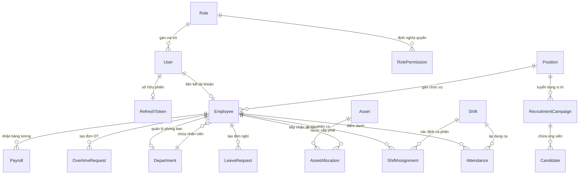

# TÀI LIỆU THỰC THỂ, THUỘC TÍNH VÀ MỐI QUAN HỆ TRONG HỆ THỐNG HRMS

## I. THUỘC TÍNH CHUNG (BASE ENTITY)
Hầu hết các thực thể chính trong hệ thống đều kế thừa từ `BaseEntity` nhằm tự động ghi vết (Auditing):

| Tên thuộc tính | Kiểu dữ liệu | Mô tả | Ghi chú |
| :--- | :--- | :--- | :--- |
| `createdAt` | `LocalDateTime` | Thời gian tạo bản ghi | Tự động sinh khi insert |
| `createdBy` | `String(50)` | Người tạo bản ghi | Lưu tên/tài khoản tạo |
| `updatedAt` | `LocalDateTime` | Thời gian cập nhật gần nhất | Tự động sinh khi update |
| `updatedBy` | `String(50)` | Người cập nhật gần nhất | Lưu tên/tài khoản sửa |

---

## II. DANH SÁCH CHI TIẾT CÁC THỰC THỂ & THUỘC TÍNH

### 1. Thực thể `User` (Bảng `users`)
Lưu trữ thông tin tài khoản đăng nhập hệ thống của tất cả thành viên.

| Thuộc tính | Kiểu dữ liệu | Ràng buộc | Mô tả |
| :--- | :--- | :--- | :--- |
| `userId` | `Long` | PK, Auto Increment | Khóa chính |
| `username` | `String(50)` | Unique, Not Null | Tên đăng nhập |
| `email` | `String(100)` | Unique, Not Null | Địa chỉ Email dùng làm định danh đăng nhập |
| `passwordHash` | `String` | Not Null, Hidden | Mật khẩu đã được mã hóa BCrypt |
| `role` | `Role` | FK (`role_id`), Eager | Vai trò của tài khoản |
| `status` | `String(20)` | Default: "ACTIVE" | Trạng thái tài khoản (ACTIVE, INACTIVE) |
| `isTemporaryPassword` | `Boolean` | Default: false | Đánh dấu mật khẩu tạm thời |
| `bankAccountNumber` | `String(30)` | Optional | Số tài khoản ngân hàng liên kết |

### 2. Thực thể `Role` (Bảng `roles`)
Định nghĩa các vai trò / quyền hạn tổng quan trong hệ thống (ADMIN, HR, EMPLOYEE, MANAGER...).

| Thuộc tính | Kiểu dữ liệu | Ràng buộc | Mô tả |
| :--- | :--- | :--- | :--- |
| `roleId` | `Long` | PK, Auto Increment | Khóa chính |
| `roleName` | `String(50)` | Unique, Not Null | Tên vai trò (ADMIN, HR, EMPLOYEE...) |
| `description` | `String(255)` | Optional | Mô tả chi tiết vai trò |

### 3. Thực thể `RolePermission` (Bảng `role_permissions`)
Phân quyền truy cập chi tiết theo từng module chức năng.

| Thuộc tính | Kiểu dữ liệu | Ràng buộc | Mô tả |
| :--- | :--- | :--- | :--- |
| `id` | `Long` | PK, Auto Increment | Khóa chính |
| `role` | `Role` | FK (`role_id`), Lazy | Vai trò được áp dụng quyền |
| `moduleCode` | `String(10)` | Not Null | Mã module chức năng (F01, F02, F03...) |
| `canView` | `Boolean` | Default: false | Quyền xem dữ liệu |
| `canEdit` | `Boolean` | Default: false | Quyền chỉnh sửa/thêm dữ liệu |
| `canApprove` | `Boolean` | Default: false | Quyền phê duyệt đơn/yêu cầu |

### 4. Thực thể `RefreshToken` (Bảng `refresh_tokens`)
Quản lý các token làm mới phiên làm việc JWT cho người dùng.

| Thuộc tính | Kiểu dữ liệu | Ràng buộc | Mô tả |
| :--- | :--- | :--- | :--- |
| `id` | `Long` | PK, Auto Increment | Khóa chính |
| `user` | `User` | FK (`user_id`), OneToOne | Tài khoản liên kết token |
| `token` | `String` | Unique, Not Null | Chuỗi Refresh Token ngẫu nhiên |
| `expiryDate` | `Instant` | Not Null | Thời gian hết hạn của Token |

### 5. Thực thể `Employee` (Bảng `employees`)
Lưu trữ hồ sơ nhân sự chi tiết của nhân viên trong công ty.

| Thuộc tính | Kiểu dữ liệu | Ràng buộc | Mô tả |
| :--- | :--- | :--- | :--- |
| `employeeId` | `Long` | PK, Auto Increment | Khóa chính mã nhân viên |
| `user` | `User` | FK (`user_id`), OneToOne | Tài khoản hệ thống liên kết |
| `fullName` | `String(100)` | Not Null | Họ và tên đầy đủ |
| `idCardNumber` | `Long` | Unique, Not Null | Số Căn cước công dân (12 chữ số) |
| `department` | `Department` | FK (`department_id`) | Phòng ban trực thuộc |
| `position` | `Position` | FK (`position_id`) | Chức vụ / Vị trí đảm nhận |
| `joiningDate` | `LocalDate` | Not Null | Ngày gia nhập công ty |
| `status` | `String(20)` | Not Null | Trạng thái làm việc (Đang hoạt động, Đang thử việc, Đã nghỉ việc) |
| `basicSalary` | `BigDecimal(15,2)` | Optional | Mức lương cơ bản thỏa thuận |

### 6. Thực thể `Department` (Bảng `departments`)
Quản lý các phòng ban trong cơ cấu tổ chức công ty.

| Thuộc tính | Kiểu dữ liệu | Ràng buộc | Mô tả |
| :--- | :--- | :--- | :--- |
| `departmentId` | `Long` | PK, Auto Increment | Khóa chính phòng ban |
| `departmentCode` | `String(20)` | Unique, Not Null | Mã định danh phòng ban (IT, HR, MKT...) |
| `departmentName` | `String(100)` | Not Null | Tên phòng ban |
| `description` | `String(255)` | Optional | Mô tả chức năng phòng ban |
| `manager` | `Employee` | FK (`manager_id`) | Nhân viên làm Trưởng phòng ban |
| `active` | `Boolean` | Default: true | Trạng thái hoạt động |

### 7. Thực thể `Position` (Bảng `positions`)
Quản lý các chức vụ / vị trí công việc.

| Thuộc tính | Kiểu dữ liệu | Ràng buộc | Mô tả |
| :--- | :--- | :--- | :--- |
| `positionId` | `Long` | PK, Auto Increment | Khóa chính |
| `positionName` | `String` | Not Null | Tên chức vụ (Developer, PM, HR Specialist...) |
| `salaryGrade` | `String` | Not Null | Bậc lương / Thang lương áp dụng |
| `active` | `Boolean` | Default: true | Trạng thái hoạt động |

### 8. Thực thể `Attendance` (Bảng `attendances`)
Lưu trữ nhật ký chấm công hàng ngày của nhân viên.

| Thuộc tính | Kiểu dữ liệu | Ràng buộc | Mô tả |
| :--- | :--- | :--- | :--- |
| `attendanceId` | `Long` | PK, Auto Increment | Khóa chính bản ghi chấm công |
| `employee` | `Employee` | FK (`employee_id`), Not Null | Nhân viên thực hiện chấm công |
| `shift` | `Shift` | FK (`shift_code`) | Ca làm việc áp dụng |
| `workDate` | `LocalDate` | Not Null | Ngày làm việc |
| `checkInTime` | `LocalDateTime` | Optional | Thời điểm điểm danh vào |
| `checkOutTime` | `LocalDateTime` | Optional | Thời điểm điểm danh ra |
| `status` | `AttendanceStatus` | Enum (ATTENDED, LATE, ABSENT) | Trạng thái chấm công |
| `lateMinutes` | `Integer` | Default: 0 | Số phút đi muộn |
| `earlyMinutes` | `Integer` | Default: 0 | Số phút về sớm |
| `checkInImage` | `String(500)` | Optional | Đường dẫn ảnh chụp khuôn mặt Check-in |
| `checkOutImage` | `String(500)` | Optional | Đường dẫn ảnh chụp khuôn mặt Check-out |

### 9. Thực thể `Shift` (Bảng `shifts`)
Định nghĩa khuôn mẫu ca làm việc chuẩn.

| Thuộc tính | Kiểu dữ liệu | Ràng buộc | Mô tả |
| :--- | :--- | :--- | :--- |
| `shiftCode` | `String(20)` | PK, Unique | Mã ca làm việc (SHIFT_HC, SHIFT_NIGHT...) |
| `shiftName` | `String(50)` | Not Null | Tên ca làm việc |
| `shiftDate` | `LocalDate` | Optional | Ngày áp dụng ca (nếu có) |
| `startTime` | `LocalTime` | Not Null | Giờ bắt đầu ca |
| `endTime` | `LocalTime` | Not Null | Giờ kết thúc ca |
| `breakDuration` | `Integer` | Default: 0 | Thời gian nghỉ giải lao (phút) |

### 10. Thực thể `ShiftAssignment` (Bảng `shift_assignments`)
Phân ca làm việc chi tiết cho nhân viên theo từng ngày.

| Thuộc tính | Kiểu dữ liệu | Ràng buộc | Mô tả |
| :--- | :--- | :--- | :--- |
| `assignmentId` | `Long` | PK, Auto Increment | Khóa chính |
| `employee` | `Employee` | FK (`employee_id`) | Nhân viên được phân ca |
| `shift` | `Shift` | FK (`shift_id` / `shift_code`) | Ca làm việc được gán |
| `assignDate` | `LocalDate` | Not Null | Ngày làm việc áp dụng ca |

### 11. Thực thể `LeaveRequest` (Bảng `leave_requests`)
Lưu trữ thông tin các đơn xin nghỉ phép.

| Thuộc tính | Kiểu dữ liệu | Ràng buộc | Mô tả |
| :--- | :--- | :--- | :--- |
| `leaveRequestId` | `Long` | PK, Auto Increment | Khóa chính đơn nghỉ phép |
| `employee` | `Employee` | FK (`employee_id`) | Nhân viên tạo đơn |
| `leaveType` | `String(20)` | Not Null | Loại nghỉ (Nghỉ phép năm, Nghỉ ốm, Nghỉ thai sản...) |
| `startDate` | `LocalDate` | Not Null | Ngày bắt đầu nghỉ |
| `endDate` | `LocalDate` | Not Null | Ngày kết thúc nghỉ |
| `totalDays` | `Float` | Not Null | Tổng số ngày nghỉ |
| `status` | `String(20)` | Not Null | Trạng thái đơn (Chờ duyệt, Đã duyệt, Từ chối) |

### 12. Thực thể `OvertimeRequest` (Bảng `overtime_requests`)
Lưu trữ các đơn đăng ký làm thêm giờ (OT).

| Thuộc tính | Kiểu dữ liệu | Ràng buộc | Mô tả |
| :--- | :--- | :--- | :--- |
| `otRequestId` | `Long` | PK, Auto Increment | Khóa chính đơn OT |
| `employee` | `Employee` | FK (`employee_id`) | Nhân viên đăng ký OT |
| `otDate` | `LocalDate` | Not Null | Ngày thực hiện làm thêm giờ |
| `startTime` | `LocalTime` | Not Null | Giờ bắt đầu OT |
| `endTime` | `LocalTime` | Not Null | Giờ kết thúc OT |
| `approvedHours` | `Float` | Optional | Số giờ OT được phê duyệt |
| `status` | `String(20)` | Not Null | Trạng thái đơn (Chờ duyệt, Đã duyệt, Từ chối) |

### 13. Thực thể `Payroll` (Bảng `payrolls`)
Bảng tính lương chi tiết theo từng kỳ lương của nhân viên.

| Thuộc tính | Kiểu dữ liệu | Ràng buộc | Mô tả |
| :--- | :--- | :--- | :--- |
| `payrollId` | `Long` | PK, Auto Increment | Khóa chính bảng lương |
| `employee` | `Employee` | FK (`employee_id`) | Nhân viên nhận lương |
| `salaryPeriod` | `String(7)` | Not Null | Kỳ lương (Định dạng YYYY-MM, ví dụ: "2026-07") |
| `basicSalary` | `BigDecimal(15,2)` | Not Null | Lương cơ bản trong kỳ |
| `allowance` | `BigDecimal(15,2)` | Optional | Các khoản phụ cấp |
| `overtimePay` | `BigDecimal(15,2)` | Optional | Tiền lương làm thêm giờ (OT) |
| `deductions` | `BigDecimal(15,2)` | Optional | Các khoản khấu trừ (bảo hiểm, phạt...) |
| `netSalary` | `BigDecimal(15,2)` | Not Null | Lương thực nhận |
| `status` | `String(20)` | Not Null | Trạng thái bảng lương (Đã tính, Đã thanh toán, Đã chốt) |

### 14. Thực thể `RecruitmentCampaign` (Bảng `recruitment_campaigns`)
Quản lý các đợt / chiến dịch tuyển dụng nhân sự.

| Thuộc tính | Kiểu dữ liệu | Ràng buộc | Mô tả |
| :--- | :--- | :--- | :--- |
| `campaignId` | `Long` | PK, Auto Increment | Khóa chính chiến dịch |
| `position` | `Position` | FK (`position_id`) | Vị trí cần tuyển dụng |
| `quantityNeeded` | `Integer` | Not Null | Số lượng chỉ tiêu cần tuyển |
| `deadline` | `LocalDate` | Not Null | Hạn chót nộp hồ sơ |
| `description` | `String(1000)` | Optional | Yêu cầu công việc và mô tả chi tiết |

### 15. Thực thể `Candidate` (Bảng `candidates`)
Hồ sơ ứng viên nộp hồ sơ ứng tuyển.

| Thuộc tính | Kiểu dữ liệu | Ràng buộc | Mô tả |
| :--- | :--- | :--- | :--- |
| `candidateId` | `Long` | PK, Auto Increment | Khóa chính ứng viên |
| `campaign` | `RecruitmentCampaign` | FK (`campaign_id`) | Chiến dịch ứng tuyển |
| `candidateName` | `String(100)` | Not Null | Họ tên ứng viên |
| `email` | `String(100)` | Optional | Email liên hệ |
| `cvFileUrl` | `String` | Not Null | Đường dẫn File CV / Hồ sơ ứng tuyển |
| `source` | `String(50)` | Optional | Nguồn tuyển dụng (TopCV, Linkedin, Website...) |
| `status` | `String(50)` | Not Null | Trạng thái hồ sơ (Mới, Đã phỏng vấn, Trúng tuyển) |

### 16. Thực thể `Asset` (Bảng `assets`)
Danh mục quản lý thiết bị, tài sản của công ty.

| Thuộc tính | Kiểu dữ liệu | Ràng buộc | Mô tả |
| :--- | :--- | :--- | :--- |
| `assetId` | `Long` | PK, Auto Increment | Khóa chính tài sản |
| `assetName` | `String(100)` | Not Null | Tên tài sản (Laptop Dell XPS, Màn hình Dell 27"...) |
| `assetType` | `String(30)` | Not Null | Phân loại tài sản (Thiết bị CNTT, Thiết bị văn phòng...) |
| `status` | `String(20)` | Not Null | Trạng thái (Mới, Đang cấp phát, Hỏng, Sửa chữa) |

### 17. Thực thể `AssetAllocation` (Bảng `asset_allocations`)
Nhật ký cấp phát tài sản cho nhân viên sử dụng.

| Thuộc tính | Kiểu dữ liệu | Ràng buộc | Mô tả |
| :--- | :--- | :--- | :--- |
| `allocationId` | `Long` | PK, Auto Increment | Khóa chính bản ghi cấp phát |
| `asset` | `Asset` | FK (`asset_id`) | Tài sản được cấp phát |
| `employee` | `Employee` | FK (`employee_id`) | Nhân viên tiếp nhận |
| `allocatedDate` | `LocalDate` | Not Null | Ngày bàn giao tài sản |
| `returnedDate` | `LocalDate` | Optional | Ngày thu hồi tài sản |

---

## III. MỐI QUAN HỆ GIỮA CÁC THỰC THỂ (RELATIONSHIPS)

### 1. Bảng tổng hợp quan hệ (ER Summary Table)

| Thực thể nguồn | Thực thể đích | Loại quan hệ | Tên trường liên kết | Ý nghĩa nghiệp vụ |
| :--- | :--- | :---: | :--- | :--- |
| `User` | `Role` | N - 1 | `role_id` | Mỗi tài khoản thuộc 1 vai trò (Admin, HR, Employee) |
| `RolePermission` | `Role` | N - 1 | `role_id` | Mỗi vai trò có danh sách quyền trên từng module |
| `RefreshToken` | `User` | 1 - 1 | `user_id` | Mỗi phiên login tạo 1 Refresh Token tương ứng |
| `Employee` | `User` | 1 - 1 | `user_id` | Mỗi nhân viên liên kết với 1 tài khoản đăng nhập |
| `Employee` | `Department` | N - 1 | `department_id` | Mỗi nhân viên thuộc 1 phòng ban |
| `Employee` | `Position` | N - 1 | `position_id` | Mỗi nhân viên đảm nhận 1 chức vụ |
| `Department` | `Employee` | N - 1 | `manager_id` | Mỗi phòng ban có 1 nhân viên làm Trưởng phòng |
| `Attendance` | `Employee` | N - 1 | `employee_id` | Mỗi bản ghi chấm công thuộc về 1 nhân viên |
| `Attendance` | `Shift` | N - 1 | `shift_code` | Chấm công theo ca làm việc đã đăng ký |
| `ShiftAssignment` | `Employee` | N - 1 | `employee_id` | Phân ca cho từng nhân viên cụ thể |
| `ShiftAssignment` | `Shift` | N - 1 | `shift_id` | Gán ca làm việc chuẩn cho phân ca |
| `LeaveRequest` | `Employee` | N - 1 | `employee_id` | Đơn nghỉ phép do 1 nhân viên tạo |
| `OvertimeRequest` | `Employee` | N - 1 | `employee_id` | Đơn đăng ký tăng ca do 1 nhân viên tạo |
| `Payroll` | `Employee` | N - 1 | `employee_id` | Bảng tính lương theo kỳ của 1 nhân viên |
| `RecruitmentCampaign` | `Position` | N - 1 | `position_id` | Đợt tuyển dụng dành cho 1 vị trí chức vụ |
| `Candidate` | `RecruitmentCampaign` | N - 1 | `campaign_id` | Ứng viên nộp hồ sơ vào 1 đợt tuyển dụng |
| `AssetAllocation` | `Asset` | N - 1 | `asset_id` | Phiếu cấp phát cho 1 tài sản cụ thể |
| `AssetAllocation` | `Employee` | N - 1 | `employee_id` | Bàn giao tài sản cho 1 nhân viên |

---

### 2. Sơ đồ liên kết thực thể ERD (Entity Relationship Diagram)

